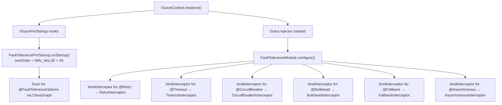
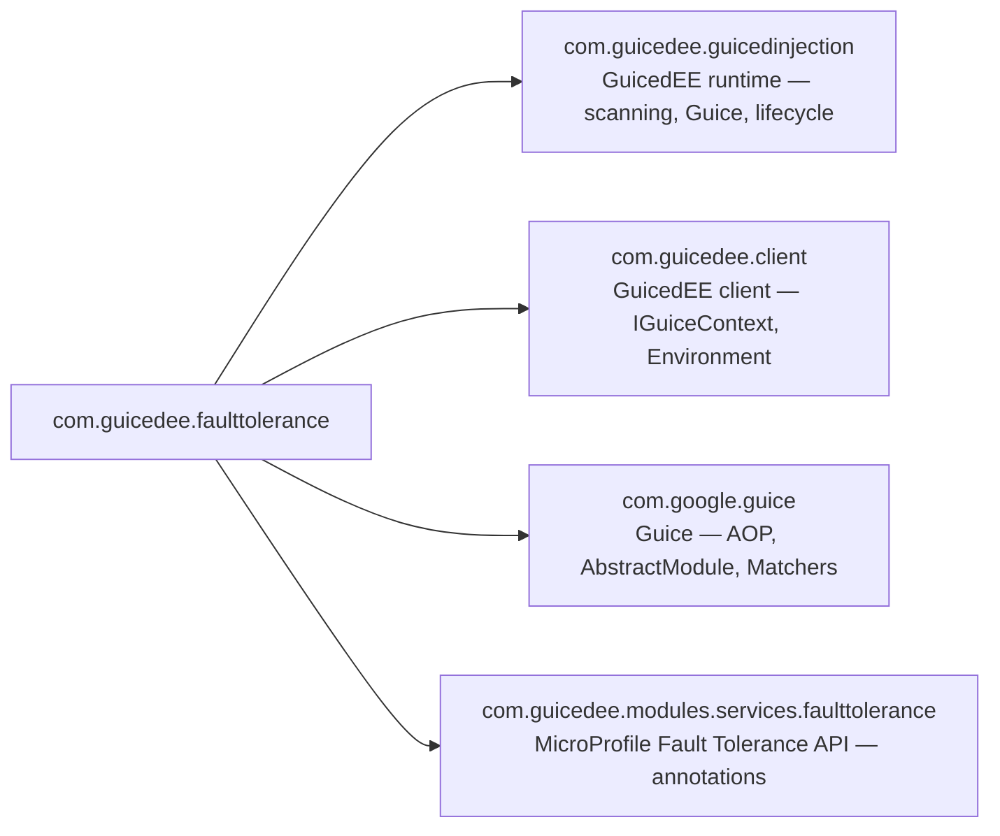

# GuicedEE Fault Tolerance

[](https://github.com/GuicedEE/FaultTolerance/actions/workflows/build.yml)
[](https://central.sonatype.com/artifact/com.guicedee/fault-tolerance)
[](https://www.apache.org/licenses/LICENSE-2.0)


Seamless **MicroProfile Fault Tolerance** integration for [GuicedEE](https://github.com/GuicedEE) applications using **Guice AOP interceptors**.
Annotate your methods with standard `@Retry`, `@Timeout`, `@CircuitBreaker`, `@Bulkhead`, `@Fallback`, and `@Asynchronous` — fault tolerance behavior is applied automatically via Guice method interception.

Built on [MicroProfile Fault Tolerance](https://github.com/eclipse/microprofile-fault-tolerance) · [Google Guice](https://github.com/google/guice) · JPMS module `com.guicedee.faulttolerance` · Java 25+

## 📦 Installation

```xml
<dependency>
  <groupId>com.guicedee</groupId>
  <artifactId>fault-tolerance</artifactId>
</dependency>
```

<details>
<summary>Gradle (Kotlin DSL)</summary>

```kotlin
implementation("com.guicedee:fault-tolerance:2.0.1")
```
</details>

## ✨ Features

- **MicroProfile Fault Tolerance annotations** — `@Retry`, `@Timeout`, `@CircuitBreaker`, `@Bulkhead`, `@Fallback`, and `@Asynchronous` are all supported
- **Guice AOP interceptors** — each annotation is backed by a dedicated Guice method interceptor
- **Class-level and method-level** — annotations can be placed on individual methods or on the class to apply to all methods
- **Configurable via annotation** — use `@FaultToleranceOptions` on any class to override global defaults
- **Environment variable overrides** — `FT_ENABLED`, `FT_RETRY_MAX_RETRIES`, `FT_TIMEOUT_VALUE`, `FT_CIRCUIT_BREAKER_FAILURE_RATIO` override annotation values
- **Composable** — stack multiple annotations on a single method (e.g. `@Retry @Timeout @Fallback`)
- **Lifecycle-aware** — integrated with `IGuicePreStartup` (scan) and `IGuiceModule` (interceptor binding)
- **Pure Guice AOP** — no SmallRye Fault Tolerance runtime dependency required; uses only the MicroProfile FT API annotations

## 🚀 Quick Start

**Step 1** — Annotate methods with MicroProfile Fault Tolerance annotations:

```java
import org.eclipse.microprofile.faulttolerance.Retry;
import org.eclipse.microprofile.faulttolerance.Timeout;
import org.eclipse.microprofile.faulttolerance.Fallback;

public class MyService {

    @Retry(maxRetries = 3, delay = 200)
    @Timeout(500)
    public String fetchData() {
        // may fail transiently
        return externalService.call();
    }

    @Fallback(fallbackMethod = "fallbackData")
    @Retry(maxRetries = 2)
    public String fetchWithFallback() {
        throw new RuntimeException("Service unavailable");
    }

    public String fallbackData() {
        return "default-value";
    }
}
```

**Step 2** — Bootstrap GuicedEE (fault tolerance interceptors are registered automatically):

```java
IGuiceContext.instance();
MyService service = IGuiceContext.get(MyService.class);
String result = service.fetchData(); // retries up to 3 times, times out after 500ms
```

No JPMS `provides` declaration is needed for annotated classes — the Guice interceptors are registered automatically via the `FaultToleranceModule`.

## 🔧 Supported Annotations

### `@Retry`

Retries a method invocation on failure.

```java
@Retry(maxRetries = 3, delay = 200, jitter = 50,
       retryOn = {IOException.class},
       abortOn = {IllegalArgumentException.class})
public String unstableCall() { ... }
```

| Attribute | Default | Description |
|---|---|---|
| `maxRetries` | `3` | Maximum number of retry attempts |
| `delay` | `0` | Delay between retries (ms) |
| `delayUnit` | `MILLIS` | Unit for delay |
| `jitter` | `200` | Random jitter added to delay (ms) |
| `jitterDelayUnit` | `MILLIS` | Unit for jitter |
| `retryOn` | `{Exception.class}` | Exceptions that trigger a retry |
| `abortOn` | `{}` | Exceptions that abort retrying |
| `maxDuration` | `180000` | Maximum total duration for all retries (ms) |

### `@Timeout`

Applies a timeout to a method invocation.

```java
@Timeout(value = 2000, unit = ChronoUnit.MILLIS)
public String slowCall() { ... }
```

| Attribute | Default | Description |
|---|---|---|
| `value` | `1000` | Timeout duration |
| `unit` | `MILLIS` | Timeout unit |

### `@CircuitBreaker`

Prevents repeated calls to a failing service.

```java
@CircuitBreaker(requestVolumeThreshold = 4,
                failureRatio = 0.5,
                delay = 5000,
                successThreshold = 2)
public String fragileCall() { ... }
```

| Attribute | Default | Description |
|---|---|---|
| `requestVolumeThreshold` | `20` | Number of calls in a rolling window |
| `failureRatio` | `0.5` | Failure ratio to trip the circuit |
| `delay` | `5000` | Time the circuit stays open (ms) |
| `successThreshold` | `1` | Successful calls to close the circuit |
| `failOn` | `{Throwable.class}` | Exceptions counted as failures |
| `skipOn` | `{}` | Exceptions not counted as failures |

### `@Bulkhead`

Limits concurrent executions.

```java
@Bulkhead(value = 5)
public String limitedCall() { ... }
```

| Attribute | Default | Description |
|---|---|---|
| `value` | `10` | Maximum concurrent calls |
| `waitingTaskQueue` | `10` | Queue size for async bulkhead |

### `@Fallback`

Provides a fallback when a method fails.

```java
@Fallback(fallbackMethod = "myFallback")
public String riskyCall() { ... }

public String myFallback() {
    return "safe-default";
}
```

| Attribute | Default | Description |
|---|---|---|
| `fallbackMethod` | `""` | Name of the fallback method |
| `value` | `Fallback.DEFAULT.class` | `FallbackHandler` implementation class |

### `@Asynchronous`

Executes a method asynchronously.

```java
@Asynchronous
public CompletableFuture<String> asyncCall() {
    return CompletableFuture.completedFuture(doWork());
}
```

## ⚙️ Configuration

### `@FaultToleranceOptions` annotation

Place `@FaultToleranceOptions` on any class to customize global defaults:

```java
@FaultToleranceOptions(
    enabled = true,
    retryMaxRetries = 5,
    timeoutValue = 2000,
    circuitBreakerFailureRatio = 0.75
)
public class MyAppConfig {
}
```

| Attribute | Default | Description |
|---|---|---|
| `enabled` | `true` | Enables or disables all fault tolerance interceptors |
| `retryMaxRetries` | `3` | Default max retries for `@Retry` |
| `timeoutValue` | `1000` | Default timeout in ms for `@Timeout` |
| `circuitBreakerFailureRatio` | `0.5` | Default failure ratio for `@CircuitBreaker` |

### Environment variable overrides

Every `@FaultToleranceOptions` attribute can be overridden with an environment variable:

| Variable | Overrides | Example |
|---|---|---|
| `FT_ENABLED` | `enabled` | `false` |
| `FT_RETRY_MAX_RETRIES` | `retryMaxRetries` | `5` |
| `FT_TIMEOUT_VALUE` | `timeoutValue` | `2000` |
| `FT_CIRCUIT_BREAKER_FAILURE_RATIO` | `circuitBreakerFailureRatio` | `0.75` |

Environment variables take precedence over annotation values.

## 📐 Startup Flow



## 🗺️ Module Graph



## 🧩 JPMS

Module name: **`com.guicedee.faulttolerance`**

The module:
- **exports** `com.guicedee.faulttolerance` and `com.guicedee.faulttolerance.implementations`
- **provides** `IGuiceModule` with `FaultToleranceModule`
- **provides** `IGuicePreStartup` with `FaultTolerancePreStartup`

## 🏗️ Key Classes

| Class | Role |
|---|---|
| `FaultToleranceOptions` | Annotation — configures global defaults and enable/disable |
| `FaultTolerancePreStartup` | `IGuicePreStartup` — scans for `@FaultToleranceOptions` and resolves configuration |
| `FaultToleranceModule` | `IGuiceModule` — binds all fault tolerance interceptors into Guice |
| `RetryInterceptor` | Guice AOP interceptor for `@Retry` |
| `TimeoutInterceptor` | Guice AOP interceptor for `@Timeout` |
| `CircuitBreakerInterceptor` | Guice AOP interceptor for `@CircuitBreaker` |
| `BulkheadInterceptor` | Guice AOP interceptor for `@Bulkhead` |
| `FallbackInterceptor` | Guice AOP interceptor for `@Fallback` |
| `AsynchronousInterceptor` | Guice AOP interceptor for `@Asynchronous` |

## 🤝 Contributing

Issues and pull requests are welcome — please add tests for new fault tolerance integrations.

## 📄 License

[Apache 2.0](https://www.apache.org/licenses/LICENSE-2.0)
